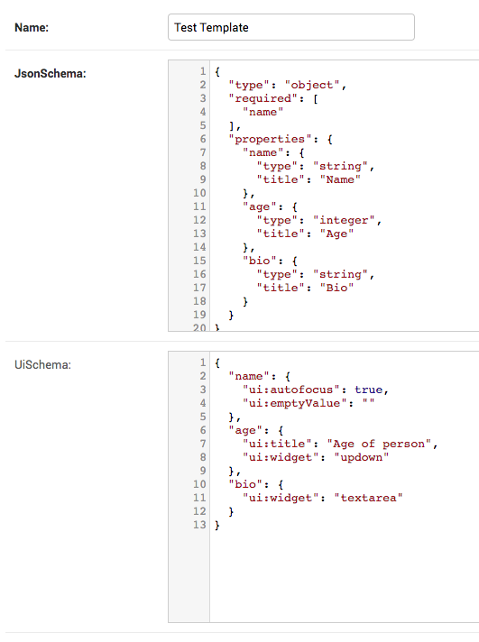
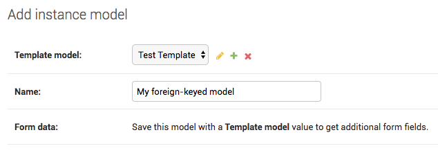
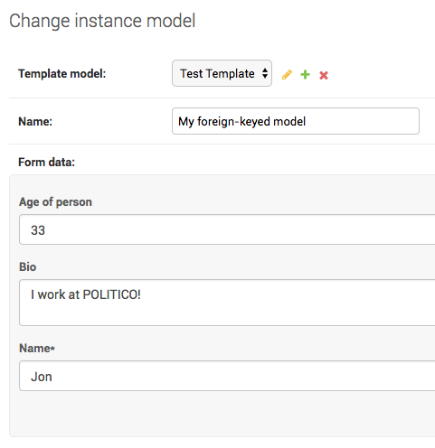

# django-foreignform

[](https://badge.fury.io/py/django-foreignform)

Dynamic fieldsets for your Django ModelAdmin using JSON schema and react-jsonschema-form.

Define dynamic fieldsets with [react-jsonschema-form](https://github.com/mozilla-services/react-jsonschema-form). Store the schema on a foreign-keyed model. Serialize the fieldsets' back to a native Django JSON field in the admin.

### Why this?

Let's explain by way of an example: At POLITICO, we use Django to model content.

Often we'll define a model that represents an individual _piece_ of content and relate that model via a foreign key to another one representing a _type_ of content. A common problem across those models are _types_ that require a special field to contain information about a _piece_.

Think of a story template. It will have some fields in common with all other types of stories: a title, a byline, etc. So we define a story model that has those fields.

We know we have different types of stories -- feature pieces, breaking news items, whatever -- and so define a story template model to group story instances by a foreign key.

In Django, our models now look like this:

  ```python
  class StoryTemplate(models.Model):
    name = models.CharField()


  class Story(models.Model):
    story_type = models.ForeignKey(StoryTemplate)
    headline = models.CharField()
    # etc.
  ```

But now we realize we need a template for a video story. Can do, but this template needs a new field: a video embed code. No other story type needs this field.

We now consider two options: 1) Add the embed field to our `Story` model, which will be useless for the 90% of our stories that are text-based. 2) Break out a new model, which will foreign key to `Story` and contain video-specific fields we can access via a reverse relationship.

**We don't really like _either_ of those options.**

In our mind, the video embed field belongs to our `StoryTemplate` because it applies to _all video stories_. So why can't we simply add it there? Well, because the _information contained in that field_ belongs to a `Story` instance, each with its own individual embed code.

What we really need is a way to define fields on the `StoryTemplate` model that can be filled out in the `Story` ModelAdmin.

With django-foreignform you can! We can use [JSON Schema](http://json-schema.org/) to define any fields specific to a template on our `StoryTemplate` model and then render those fields dynamically in a ModelAdmin for our `Story` model. As users fill out these dynamic fields, their values are serialized back to a JSON field on the `Story` model.

So instead our models look something like this:

  ```python
  class StoryTemplate(models.Model):
    name = models.CharField()
    json_schema = JSONField()


  class Story(models.Model):
    story_type = models.ForeignKey(StoryTemplate)
    headline = models.CharField()
    form_data = JSONField()
    # etc.
  ```

We can then define our video field via JSON schema on the `StoryTemplate` like this:

  ```json
  {
    "type": "object",
    "properties": {
      "video": {
        "type": "string",
        "title": "Video embed code"
      }
    }
  }
  ```

... which, once it's filled in by a user on a `Story` model, may then serialize to data like this:

  ```json
  {
    "video": "https://www.youtube.com/watch?v=wuK0f-Zur9A"
  }
  ```

##### Upshot

A long way to say django-foreignform lets us write more complex models while keeping the relationships in our database very simple. It helps us avoid extra models to handle edge cases or cluttering up the models we have with rarely used fields.


### Buyer beware

This library is very early days for us. It may not be ready for your own production needs.

Forms it creates definitely **should not** be used by anyone who's not a friend to your organization. While react-jsonschema-form gives us some light data validation options on the form it renders, you're trading against Django's robust model validation. It's also very easy for a bad actor to circumvent the form and insert values into the hidden JSON field.

For all those reasons, this library only renders forms in Django's admin, which should encourage you to only give access to trusted staff.

All that said, you should try it out! Pull requests welcome!


### Requirements

- PostgreSQL ≥ 9.4
- Django ≥ 2.0

### Quickstart

1. Install the app.

  ```
  $ pip install django-foreignform
  ```

2. Add the app to your Django project and configure settings.

  ```python
  INSTALLED_APPS = [
      # ...
      'foreignform',
  ]
  ```
3. Define a template model from our base class and an instance foreign-keyed to the first with a dedicated JSON field for your form data.

  ```python
  from foreignform.models import ForeignFormBaseModel

  class StoryTemplate(ForeignFormBaseModel):
      name = models.CharField(max_length=100)
      # ...

  class Story(models.Model):
      template = models.ForeignKey(StoryTemplate, on_delete=models.PROTECT)
      name = models.CharField(max_length=100)
      form_data = JSONField(blank=True, null=True)
      # ...
  ```
4. Use our mixin to create a ModelAdmin for your foreign-keyed model with properties for the foreign key field and the JSON field for your form data.

  ```python
  from django.contrib import admin
  from foreignform.mixins import ForeignFormAdminMixin
  from .models import StoryTemplate, Story


  class StoryAdmin(ForeignFormAdminMixin, admin.ModelAdmin):
      foreignform_foreign_key = 'template'
      foreignform_field = 'form_data'


  admin.site.register(StoryTemplate)
  admin.site.register(Story, StoryAdmin)
  ```

5. In the admin for a template model, define some fields on your model using [JSONSchema](http://json-schema.org/) syntax and react-jsonschema-form's [UI schema](https://github.com/mozilla-services/react-jsonschema-form#the-uischema-object).

  

6. In the admin for an instance, create an instance with a foreign key to the template model. Click `Save and continue editing`.

  

7. With the foreign key saved, you can now fill out fields defined in the template model's JSON schema. Behind the scenes, the formset is being serialized and saved to your instance model's JSON field.

  

8. Use the serialized JSON data from your form in your model's JSON field.

  ```python
  Story.objects.first().form_data
  ```

### Developing

##### Running a development server

Developing python files? Move into example directory and run the development server with pipenv.

  ```
  $ cd example
  $ pipenv run python manage.py runserver
  ```

Developing static assets? Move into the pluggable app's staticapp directory and start the node development server, which will automatically proxy Django's development server.

  ```
  $ cd foreignform/staticapp
  $ gulp
  ```

Want to not worry about it? Use the shortcut make command.

  ```
  $ make dev
  ```

##### Setting up a PostgreSQL database

1. Run the make command to setup a fresh database.

  ```
  $ make database
  ```

2. Add a connection URL to the `.env` file.

  ```
  DATABASE_URL="postgres://localhost:5432/foreignform"
  ```

3. Run migrations from the example app.

  ```
  $ cd example
  $ pipenv run python manage.py migrate
  ```
